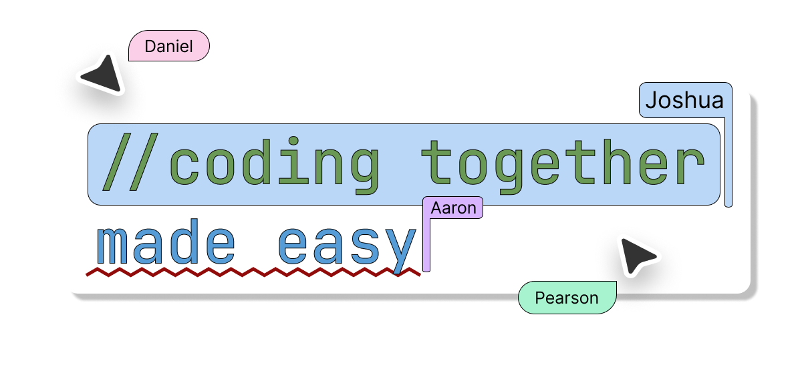
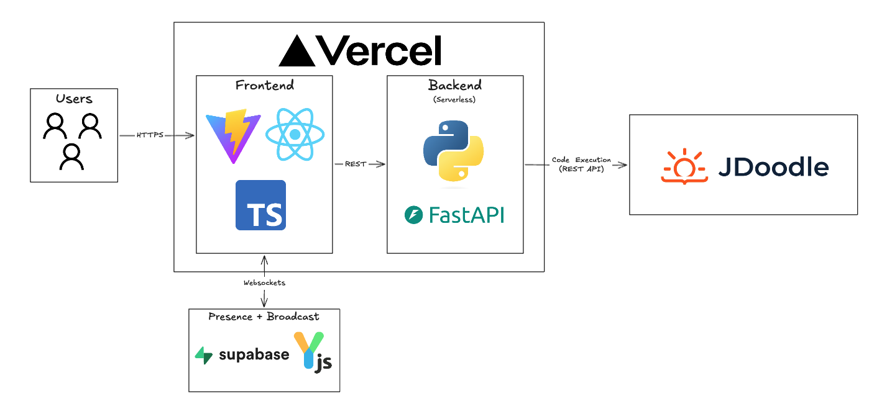

# Code Along



Simple and quick real-time collaborative code editor. Create a room, share the link, and code together instantly — no sign-up required. Perfect for pair programming, technical interviews, and tutoring sessions.

## Architecture



The frontend uses the React framework with Typescript powered by Vite. Real-time collaboration is handled by [Yjs](https://yjs.dev/) with [y-supabase](https://github.com/supabase-labs/y-supabase) as the sync provider, syncing document state through Supabase's realtime infrastructure. Code execution is proxied through a FastAPI backend that calls the [JDoodle](https://www.jdoodle.com/) compiler API. Both the frontend and backend are deployed on Vercel, with the backend running as a serverless function.

## Local Development

### Prerequisites

- [Node.js](https://nodejs.org/) v18+
- [Python](https://python.org/) 3.13+
- [uv](https://docs.astral.sh/uv/) (Python package manager)
- [Supabase](https://supabase.com/) project (for realtime sync)
- [JDoodle](https://www.jdoodle.com/) API credentials (for code execution)

### Environment Variables

```env
JDOODLE_CLIENT_ID=your_client_id
JDOODLE_CLIENT_SECRET=your_client_secret
VITE_SUPABASE_URL=your_supabase_url
VITE_SUPABASE_PUBLISHABLE_KEY=your_supabase_publishable_key
```

### Frontend

```bash
npm install # Will also install the Python dependencies
npm run dev
```

The frontend will be available at `http://localhost:5173`.

### Backend

```bash
npm run api
```

The API will be available at `http://localhost:8000`. Swagger docs are at `http://localhost:8000/api/docs`.

### Other Scripts

```bash
npm run build          # Frontend production build
npm run lint           # Lint TypeScript
npm run format         # Format TypeScript
npm run lint-api       # Lint Python
npm run format-api     # Format Python
```

## License

MIT

Open to contributions or feature suggestions by opening an issue or pull request.
